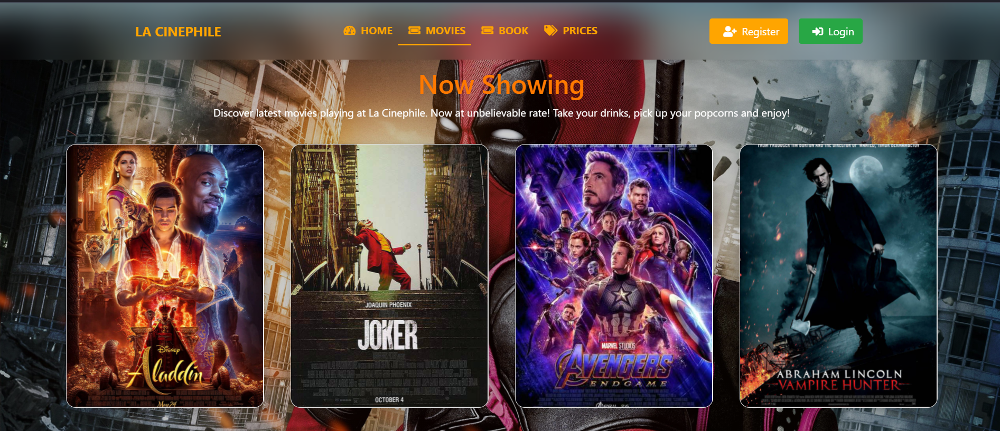
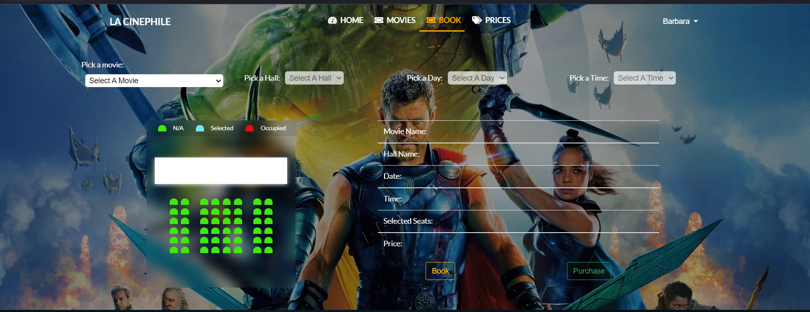
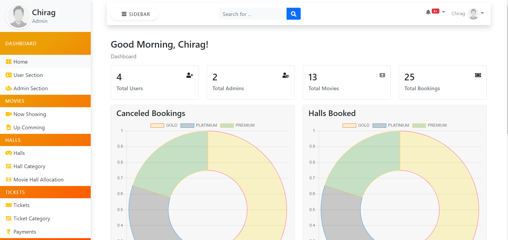
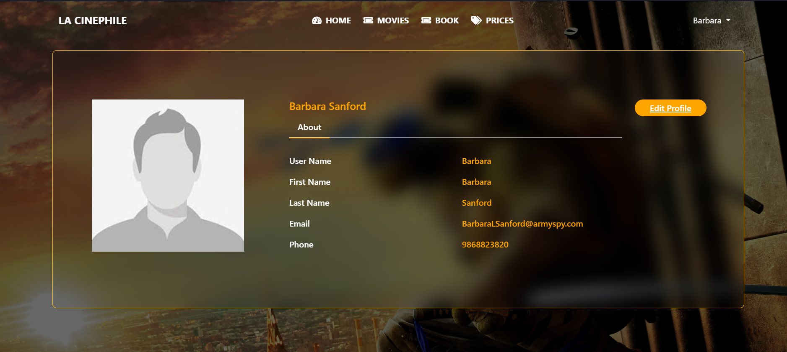

# La CinePhile

We have all been in a situation where we must stand in a long queue to buy movie tickets. Have
you ever been in the queue for hours, only to realize that they’ve run out of tickets? Don’t
worry, La CinePhile is here to solve this problem!
La CinePhile is a movie ticket registration site for a movie theater built using HTML, CSS,
JavaScript, Ajax, and Bootstrap. Through this website, users will be able to book or buy tickets
online. Since, most ticket registration systems you see online are crowded with unnecessary
details, users may feel uneasiness to navigate those sites. But with La CinePhile, users can easily
find the movie through our user-friendly interface and minimalistic design, one of the cores of
Nielsen's heuristics for UI design.

    
## Features

- Login and Registration for users
- Two different user roles
- Password-reset link through email
- Dashboard based on user roles
- Enables visitors to browse through movie listings, select them and view details
- Allows users to make payments for movies through Khalti
- Allows Users to reserve tickets and pay later using the same payment gateway
- Allows Admin to add/update/remove movies
- Allows Admin to set showtimes for different movies
- Preserves user’s movie history

  
## Screenshots

 

## Authors

- [@chiragsimkhada](https://github.com/Chirag123-bit)

  
## Feedback

If you have any feedback, please reach me out at 200048@softwarica.edu.np

  
## Appendix

 Admin Credintials:
- Username: HallAdmin
- Password: Abcd@1234

Normal User:
- Username: Chirag1
- Password: Abcd@1234

  
